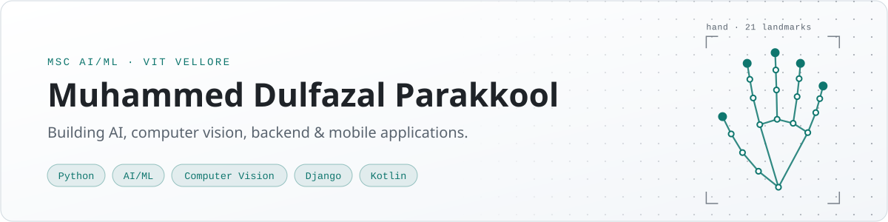

<!--
  Profile README for github.com/dulfazl

  How to edit:
  * Banner       : assets/banner-dark.svg and assets/banner-light.svg (plain SVG, edit the <text> lines in both)
  * Projects     : each project is one <td> block under "Featured projects". Copy a block to add one.
  * Tech stack   : one <tr> per category.
  * GitHub stats : switched off for now, see the commented block near the bottom.
-->

<picture>
  <source media="(prefers-color-scheme: dark)" srcset="assets/banner-dark.svg">
  <source media="(prefers-color-scheme: light)" srcset="assets/banner-light.svg">
  
</picture>

### Hi, I'm Dilu.

I'm an MSc Artificial Intelligence & Machine Learning student at **VIT Vellore**, with a BCA behind me. I learn by building: computer vision models, the backend services around them, and the mobile apps that put them in front of people.

I'm still learning, and I'm serious about getting very good at this. The projects below are things I've built or am building. Where something is unfinished, private, or still an idea, it says so.

## Featured projects

<table>
<tr>
<td colspan="2" valign="top">

**[Indian Sign Language Recognition](https://github.com/dulfazl/yolov11-isl)** &nbsp;·&nbsp; *in progress*

Recognizing Indian Sign Language from video. Most sign-language work targets ASL. ISL is largely two-handed and has far less annotated public data, which makes it a harder problem and a more useful one.

- **Now:** MediaPipe hand-landmark extraction feeding an LSTM sequence model, aimed at sentence-level recognition rather than isolated signs
- **Earlier:** YOLO-based object detection experiments on a 35-class Indian hand-sign dataset, in PyTorch

`Python` `MediaPipe` `LSTM` `PyTorch` `YOLO`

</td>
</tr>
<tr>
<td width="50%" valign="top">

**YouTube Video Summarizer**

A Django web app that processes YouTube videos and generates summaries of them with NLP.

`Python` `Django` `Hugging Face Transformers` `AssemblyAI` `Pytube`

</td>
<td width="50%" valign="top">

**Crawford Car Accessories** &nbsp;·&nbsp; *web + Android*

Website and backend for a car accessories business: Django and DRF serving a REST API (`/api/products/`), deployed on cloud hosting. Alongside it, a Kotlin Android app for the same ecosystem that integrates with the REST API.

`Django` `Django REST Framework` `Kotlin` `Android Studio`

</td>
</tr>
<tr>
<td width="50%" valign="top">

**[PITLANE](https://github.com/dulfazl/pitlane)**

Live service tracking for a car care workshop. Customers follow every stage of the work on their car from their phone, and staff run the same board from the shop floor. One Expo codebase for Android and iOS with a Node/Express + SQLite API behind it.

`React Native` `Expo` `TypeScript` `Node.js` `SQLite`

</td>
<td width="50%" valign="top">

**Maître** &nbsp;·&nbsp; *private*

An AI maître d' for restaurants: QR-scanned, allergy-aware, conversational ordering. Guests talk to it instead of tapping through a PDF menu.

`TypeScript`

</td>
</tr>
</table>

**Also**

- **Soq Car Care**: a car-care and car-wash booking app. Mobile client, booking workflows, backend/API integration.
- **AI Copilot for Data Analytics** *(concept, in planning)*: ask natural-language questions about a dataset and get analysis, visualizations and automated insights back.
- **Client web work** *(private)*: shipped sites for an equipment supplier and a cargo business, plus a Django build.

## Tech stack

<picture>
  <source media="(prefers-color-scheme: dark)" srcset="https://skillicons.dev/icons?i=python%2Cjava%2Ckotlin%2Cpytorch%2Ctensorflow%2Csklearn%2Copencv%2Cdjango%2Cmysql%2Candroidstudio%2Cflutter%2Cgit%2Clinux&theme=dark&perline=13">
  <source media="(prefers-color-scheme: light)" srcset="https://skillicons.dev/icons?i=python%2Cjava%2Ckotlin%2Cpytorch%2Ctensorflow%2Csklearn%2Copencv%2Cdjango%2Cmysql%2Candroidstudio%2Cflutter%2Cgit%2Clinux&theme=light&perline=13">
  
</picture>

<table>
<tr><td><b>Languages</b></td><td>Python · Java · Kotlin · SQL · JavaScript / TypeScript (basics)</td></tr>
<tr><td><b>AI / ML</b></td><td>PyTorch · TensorFlow · scikit-learn · Hugging Face Transformers · YOLO</td></tr>
<tr><td><b>Computer vision</b></td><td>OpenCV · MediaPipe · TensorFlow Lite for on-device models</td></tr>
<tr><td><b>Data</b></td><td>Pandas · NumPy · Matplotlib · EDA · model evaluation</td></tr>
<tr><td><b>Backend & web</b></td><td>Django · Django REST Framework · REST APIs · Next.js</td></tr>
<tr><td><b>Mobile</b></td><td>Android (Kotlin) · Flutter / FlutterFlow</td></tr>
<tr><td><b>Databases</b></td><td>MySQL · SQLite</td></tr>
<tr><td><b>Tools</b></td><td>Git · Linux · Jupyter / Colab · Android Studio · VS Code · Oracle Cloud · Netlify</td></tr>
</table>

## What I'm learning right now

- **Building:** sentence-level sign recognition with MediaPipe and LSTMs
- **Studying:** machine learning, probability & statistics, data structures & algorithms, DBMS, software engineering
- **Practicing:** deeper Python, Java, and competitive programming

<b>ML topics I've worked through so far</b>

 

- **Supervised learning:** Linear SVM · Naive Bayes · KNN · Decision Trees · Random Forest
- **Unsupervised learning:** K-Means · DBSCAN · hierarchical clustering · anomaly detection
- **Optimization:** gradient descent · stochastic gradient descent · convex optimization
- **Deep learning:** neural networks · object detection · sequence modeling
- **Large-scale data:** recommendation systems · MapReduce · Bloom filters · Count-Min Sketch

## Where I'm headed

- Get properly strong in Python, and sharper at Java and competitive programming
- Build firmer math and statistics foundations for ML
- Take AI/ML projects to production quality: built, deployed and usable, not only trained
- Go deeper into computer vision and learn how scalable ML systems are put together
- Earn an AI/ML internship

<!--
## GitHub stats

Switched off on purpose. These cards only count public repos, so turn them on once more of the
projects above are pushed here. To enable, delete this comment wrapper and keep the two images.

-->

## Get in touch

Open to **AI/ML internships**.

[LinkedIn](https://www.linkedin.com/in/dulfazal/) · [Portfolio](https://dulfazl.github.io/portfolio/) · [Instagram](https://instagram.com/dulfazl)
